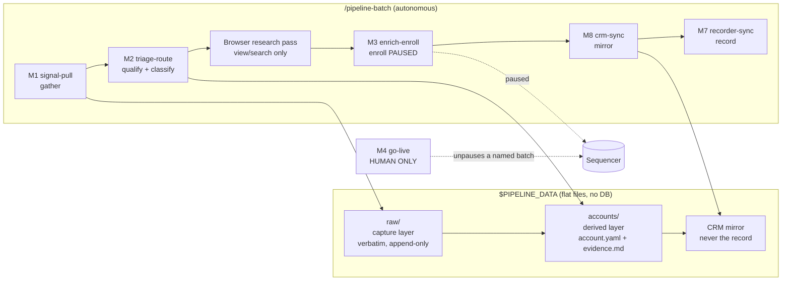

# gtm-prospect-pipeline

Signal-driven outbound prospecting, run by Claude Code, expressed as three config files plus
a set of skills. A batch pulls companies that just emitted a buying signal (a job posting, a
title change, a referral), qualifies each one against your ICP with a three-source
verification pass, enrolls the right contacts into the right sequence **paused**, and mirrors
the result into a CRM. Nothing sends until a human names a batch and says go. The pipeline
is identify → qualify → enroll-paused → mirror. The hard rules are enforced by scripts and
config keys, not by prose, and the judgment-heavy modules carry regression evals so a prompt
edit cannot silently un-learn a lesson the pipeline already paid for.

## What it will never do

- Send an email without a human "go" on a named batch (`/m4-go-live` is the only unpause).
- Unpause anything from a scheduled or headless run.
- Perform LinkedIn outreach actions: no connection requests, messages, InMail, follows,
  reactions, or posts. The browser research pass is view/search only.
- Treat the CRM as the source of truth. The flat-file store outranks it on every conflict, and
  the CRM never triggers a send.
- Create an account record without first confirming it does not already exist.

The full list, with the mechanism that enforces each rule and the incident behind it, is in
[SAFETY.md](SAFETY.md).

## Architecture



Three data layers, strictly ordered: every API or browser response lands verbatim in `raw/`
before anyone interprets it; `accounts/` is derived from `raw/` and is the canonical state;
the CRM is a mirror of `accounts/`. Modules are either gatherers (write `raw/`), processors
(read `raw/`, write `accounts/`, never fetch), or mirrors (read `accounts/`, write the CRM).
No module fetches and interprets in the same step. Details in
[ARCHITECTURE.md](ARCHITECTURE.md).

## Quickstart

Prerequisites:

- Node 24+ (scripts are plain TypeScript run with `node <script>.ts`, no build step).
- [Claude Code](https://docs.anthropic.com/en/docs/claude-code) with the Apollo and
  TheirStack MCP connectors enabled.
- Optional: a [Twenty](https://twenty.com) CRM instance (M8 is a no-op without it).
- Optional: Claude-in-Chrome with a logged-in Sales Navigator session for the research pass.
  Without it the batch degrades cleanly (see ARCHITECTURE.md, "Headless profile").

Steps:

```bash
git clone <this repo> && cd gtm-prospect-pipeline
npm install                                   # one dependency: yaml

mkdir -p ~/.config/gtm-prospect-pipeline
cat > ~/.config/gtm-prospect-pipeline/env <<'ENV'
PIPELINE_DATA=$HOME/Data/gtm-prospect-pipeline
TWENTY_BASE_URL=                              # leave blank to run without a CRM
TWENTY_API_KEY=
ENV
chmod 600 ~/.config/gtm-prospect-pipeline/env

# Edit the three files that are yours:
#   config/signal.yaml     what a signal is and where it comes from
#   config/sequences.yaml  which sequence each signal feeds, caps, suppression, merge fields
#   config/icp.md          what a fit looks like, disqualifiers, drop classes

node lib/sequence-resolver.ts --validate      # after ANY config edit
npm test                                      # store, resolver, guards, eval harness
```

Then, inside Claude Code at the repo root:

```
/pipeline-batch        # M1 -> M2 -> research pass -> M3 (paused) -> M8 -> M7
/m4-go-live <batch>    # when you are ready: the one human gate; unpauses exactly that batch
```

The first batch will stop early if `config/sequences.yaml` still carries placeholder ids or
the sequence is `status: draft`. That is the lifecycle doing its job: M3 holds accounts at
`status: routed` until a bound sequence is `active`.

## What you configure vs what you don't

| You edit | You leave alone |
|---|---|
| `config/signal.yaml` (signal catalog, acquisition recipes, dedupe, limits, per-signal policy gates) | `skills/*/SKILL.md` (module procedure and hard rules) |
| `config/sequences.yaml` (sequence ids, lifecycle, `binds`, caps, suppression, merge fields) | `lib/` (store primitives, resolver, guards, CRM adapter) |
| `config/icp.md` (judgment: fit, disqualifiers, drop classes, optional classification tags) | `commands/pipeline-batch.md` (orchestrator) |

Sequence ids and caps live only in `config/sequences.yaml`. No skill or script hardcodes
them. A cap quoted from memory is a bug.

## Modules

| Module | One line |
|---|---|
| M1 `signal-pull` | Gathers. Runs every enabled signal block, captures payloads and posting text to `raw/`, creates account stubs only after the pull-guard confirms the domain is new. |
| M2 `triage-route` | Processes. Fit triage against `icp.md`, identity plus three-source verification, then a binary account-level route: `QUALIFIED`, `SKIP`, `FLAGGED`, or `DROPPED`. Route is classification only. |
| M3 `enrich-enroll` | Enriches contacts and enrolls them paused, within caps, after the suppression gate, into whatever sequence the resolver returns. |
| M4 `go-live` | Human only. Unpauses exactly the batch you name and confirms counts back. Never runs headless. |
| M5 `evidence-collector` | Per-account deep evidence into `evidence.md`, one citation per fact, for qualification and reply prep. |
| M7 `recorder-sync` | Human-facing records: registry, progress log, structured run record, decision ledger, dashboard. |
| M8 `crm-sync` | Mirrors `accounts/` to the CRM (push), pulls sequencer state back through `raw/` (reconcile), and audits drift. |
| `/pipeline-batch` | Thin orchestrator: run-start ritual, then M1 → M2 → research pass → M3 → M8 → M7. |

There is no M6. It was a per-account artifact generator that was retired when the deliverable
became standardized sequence copy; the numbering is kept so module references stay stable.

## Evals

M2 (fit triage, routing), the browser verdict, and M5 evidence synthesis are prompt-driven:
their behaviour is the text of a `SKILL.md` plus `config/icp.md`. `evals/` holds frozen
fixtures for each of those tasks, each fixture a real decision with a gold answer and a
`forbidden` trap naming the specific wrong answer that once happened. `node evals/run.ts`
scores the live skill text against the fixtures, live against the model or replayed from
committed responses for $0, and diffs against a baseline.

The fixtures shipped here are synthetic. In a private fork, replace them with your own
corrected decisions (`evals/draft-fixture.ts` drafts one from a raw capture) so the suite
guards your judgment, not a made-up one. `bash scripts/check-evals.sh` runs before any edit
to `skills/*/SKILL.md`, `config/icp.md`, `config/signal.yaml`, or `config/sequences.yaml`
lands, and exits 1 until fixtures and skill text agree.

## Swapping connectors

TheirStack (signal source), Apollo (enrichment and sequencing), and Twenty (CRM) are
reference adapters, not requirements. Signal blocks in `config/signal.yaml` declare their
connector; adding one means a new acquisition recipe and the same downstream (pull-guard,
stub write, dedupe). Twenty sits entirely behind `lib/twenty.ts` and the M8 scripts; any CRM
with a REST API that can upsert a company, a person, and a note can replace it. Sales
Navigator has no API and is reached only through a browser, view/search only.

## Status

Extracted from a private pipeline that ran daily for about two months, enrolling into live
sequences under these rules. It ships as a template: the engine, the guards, the evals
harness, and heavily commented config files. The author's ICP, signal definitions, sequence
copy, and fixtures are deliberately not included. Everyone writes their own.

## License

MIT. Author: Scott Jennings.
