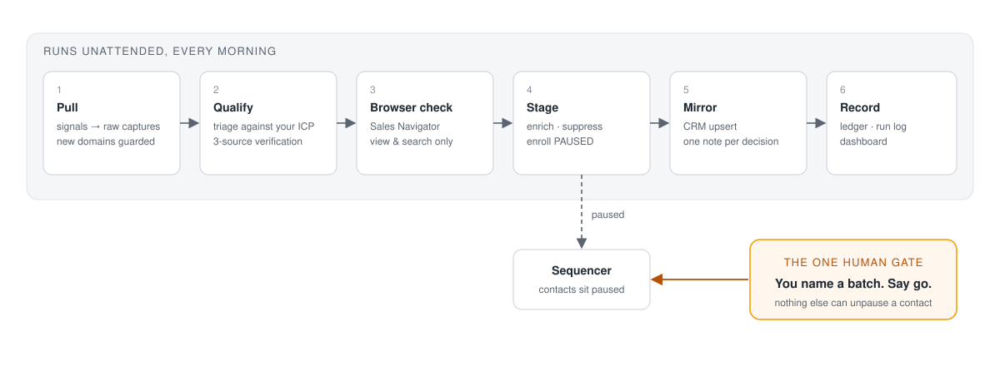
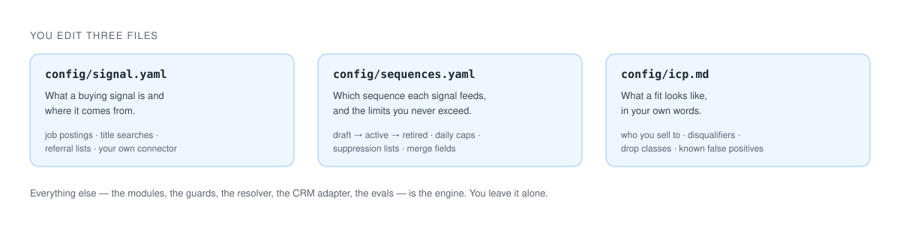

# gtm-prospect-pipeline

**Outbound that runs itself, right up to the send button.**

Every morning a batch pulls the companies that just showed a buying signal, checks each one
against your ICP from three independent sources, stages the right contacts in the right
sequence, and mirrors everything into your CRM. Your job shrinks to one decision a day: look
at the batch, say go.

Built on Claude Code. Configured in three files. No dashboard to learn, no vendor to onboard.



## What you get

**A prospect list that is actually qualified.** Not "matched a filter" qualified. Each
account carries the job posting that triggered it, the leadership page, the people sweep,
and the Sales Navigator notes, every claim cited to a captured file. When a prospect
replies, the evidence for the call is already on disk.

**Signals you define, in plain YAML.** A job posting that mentions a technology. A title
that just opened. A referral list. Each signal is a block in one config file. Bind it to a
sequence and the pipeline picks up the rest.

**Spend that goes to survivors.** Fit triage runs on free data first. Enrichment credits,
job-text credits, and browser lookups are spent only on accounts that cleared it.

**A second opinion the APIs can't give.** Enrichment data lags reality. Before anything is
staged, Claude opens Sales Navigator and checks whether the person your pitch assumes is
missing was hired last month. View and search only, capped, paced, captured.

**A CRM that stays true.** The flat-file store is the record; the CRM is a mirror. Push is
idempotent. Drops never reach the CRM. Suppression decisions always do.

**Judgment that does not drift.** The qualification rules are prompts, and prompts get
edited. A regression suite scores the live rules against frozen decisions before any edit
lands, so a lesson you already paid for cannot be un-learned by a wording change.

## Setup is a conversation

Clone, install, then type `/setup` in Claude Code. It interviews you about who you sell to,
what the buying signal is, and what a disqualifier looks like, then writes the three config
files from your answers, pulls your real sequence and field ids through the Apollo
connector, sizes your signal pool at zero cost, and runs the checks. Fifteen minutes,
no YAML written by hand.

```bash
git clone https://github.com/sajennings79/gtm-prospect-pipeline && cd gtm-prospect-pipeline
npm install
claude            # then, inside Claude Code:
/setup
```

Prerequisites: Node 24+ and [Claude Code](https://docs.anthropic.com/en/docs/claude-code)
with the Apollo and TheirStack MCP connectors. Optional: a [Twenty](https://twenty.com) CRM
and Claude-in-Chrome with a Sales Navigator login for the browser check. `npm run doctor`
shows what's configured and what's still open, any time.



## Then, every day

```
/pipeline-batch          # pull → qualify → browser check → stage (paused) → mirror → record
/m4-go-live <batch>      # you, when you're ready
```

Sequences start as `draft`. Until you flip one to `active`, batches qualify and stage
accounts and hold them at `routed`, so you can watch the pipeline judge for a week before
a single email is queued. Approve your copy, change one word in `config/sequences.yaml`,
and the held accounts flow into the sequence on the next run without re-triage.

## What you could build on it

- **Multiple lanes.** Each signal binds to its own sequence with its own copy and merge
  fields. Run a hiring-signal lane, a tech-adoption lane, and a referral lane side by side.
  The resolver refuses two active sequences that would claim the same account.
- **Successor copy without re-triage.** A new sequence version enters as `draft`, then
  `supersedes` the old one. Accounts held on the retired version flow into the new one the
  moment it goes `active`.
- **Call prep on demand.** The evidence collector writes a per-account brief with one
  citation per fact, graded fact / inference / hypothesis. Point it at a replied account
  before the call.
- **Your CRM, not ours.** Twenty ships as the reference adapter behind one client file. Any
  CRM that can upsert a company, a person, and a note swaps in.
- **A second signal source in an afternoon.** Apollo company search is already wired as a
  second connector. Adding a third is a new acquisition recipe and the same downstream.
- **Your own eval corpus.** Every correction you make becomes a fixture. The suite grows
  into a record of your team's judgment that survives staff changes and prompt rewrites.

## Built to be trusted with your domain

Cold outbound runs on a reputation you cannot buy back. The pipeline treats that as the
design constraint:

- A human names every batch that sends. Scheduled runs stage; they never activate.
- Every enrollment passes the suppression check first, every time.
- Mailbox caps live in config and are read at the moment they matter.
- LinkedIn activity is view and search only, capped and paced. A restriction warning stops
  the run.

Each rule, the mechanism that enforces it, and the incident that produced it is in
[SAFETY.md](SAFETY.md). The design is in [ARCHITECTURE.md](ARCHITECTURE.md). The reasoning
behind the bigger choices is in [docs/decisions](docs/decisions).

## Modules

| Module | Role |
|---|---|
| `/setup` | Agent-led onboarding. Interview → config → connector ids → checks. |
| M1 `signal-pull` | Gather. Run signals, capture raw, stub new accounts. |
| M2 `triage-route` | Qualify. Triage, verify, classify. Runs the browser check. |
| M3 `enrich-enroll` | Stage. Enrich, suppress, enroll paused. |
| M4 `go-live` | Human only. Unpause a named batch. |
| M5 `evidence-collector` | Deep evidence per account, one citation per fact. |
| M7 `recorder-sync` | Registry, run record, decision ledger, dashboard. |
| M8 `crm-sync` | Push, reconcile, audit the CRM mirror. |
| `/pipeline-batch` | The orchestrator. Thin by design. |

## Evals

The qualifying modules are prompt-driven, so `evals/` holds frozen decisions with a gold
answer and a named wrong answer that once happened. `node evals/run.ts` scores the live rules
against them, live or replayed at $0, and `scripts/check-evals.sh` gates every edit to a
skill or config file. The fixtures shipped here are synthetic; replace them with your own
corrected decisions in a private fork.

## License

MIT. Author: Scott Jennings.
