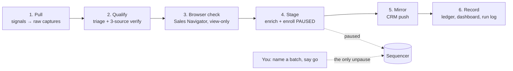

# gtm-prospect-pipeline

**Outbound that runs itself, right up to the send button.**

Every morning a batch pulls the companies that just showed a buying signal, checks each one
against your ICP from three independent sources, stages the right contacts in the right
sequence, and mirrors everything into your CRM. Your job shrinks to one decision a day: look
at the batch, say go.

Built on Claude Code. Configured in three files. No dashboard to learn, no vendor to onboard.

---

## What it did in production

Ten weeks of daily runs for a B2B consulting practice, using TheirStack for signals, Apollo
for enrichment and sequencing, and Twenty as the CRM.

| | |
|---|---|
| Companies evaluated | 936 |
| Dropped at triage, before spending a credit on enrichment | 420 (45%) |
| Verified by a human-grade browser check on LinkedIn Sales Navigator | 350 |
| Routing decisions the browser check overturned after the API data had said "go" | 71 of 178 (40%) |
| Contacts staged into sequences, every one paused until a human named the batch | 378 |
| Unattended runs completed end to end | 33 of 35 |
| Emails sent without a human go | 0 |

That 40% line is the whole argument for the pipeline. API data alone would have pitched
four in ten of those accounts to a company that had already hired the person the pitch
assumed they were missing. The browser pass caught it, on every batch, without anyone
sitting at the keyboard.

## What you get

**A prospect list that is actually qualified.** Not "matched a filter" qualified. Each
account carries the job posting that triggered it, the leadership page, the people sweep,
and the Sales Navigator notes, every claim cited to a captured file. When a prospect
replies, the evidence for the call is already on disk.

**Signals you define, in plain YAML.** A job posting that mentions a technology. A title
that just opened. A referral list. Each signal is a block in one config file. Bind it to a
sequence and the pipeline picks up the rest.

**Spend that goes to survivors.** Fit triage runs on free data first. Enrichment credits,
job-text credits, and browser lookups are spent only on accounts that cleared it.

**A CRM that stays true.** The flat-file store is the record; the CRM is a mirror. Push is
idempotent. Drops never reach the CRM. Suppression decisions always do.

**Judgment that does not drift.** The qualification rules are prompts, and prompts get
edited. A regression suite scores the live rules against frozen decisions before any edit
lands, so a lesson the pipeline already paid for cannot be un-learned by a wording change.

## How it works



1. **Pull.** Every enabled signal runs. Responses land verbatim in `raw/` before anything
   reads them. New domains get an account stub only after a guard confirms they are new.
2. **Qualify.** Fit triage against `config/icp.md`, then identity plus three-source
   verification. Each account gets one binary route: `QUALIFIED`, `SKIP`, `FLAGGED`, or
   `DROPPED`.
3. **Browser check.** Claude drives a logged-in Sales Navigator session, view and search
   only, and confirms or flips the routing. Capped, paced, captured at observation time.
4. **Stage.** Contacts are enriched, checked against every suppression list, and enrolled
   paused into whatever sequence the config resolves for their signal.
5. **Mirror.** Accounts and people upsert into the CRM with a note per decision.
6. **Record.** Registry entry, structured run record, decision ledger, dashboard.

Then you open the dashboard, read the batch, and run `/m4-go-live` on it. Nothing else in
the system can unpause a contact.

## What you could build on it

- **Multiple lanes.** Each signal binds to its own sequence with its own copy and merge
  fields. Run a hiring-signal lane, a tech-adoption lane, and a referral lane side by side.
  The resolver refuses two active sequences that would claim the same account.
- **Successor copy without re-triage.** A new sequence version enters as `draft`, then
  `supersedes` the old one. Accounts held on the retired version flow into the new one the
  moment it goes `active`.
- **Call prep on demand.** The evidence collector writes a per-account brief with one
  citation per fact, graded fact / inference / hypothesis. Point it at a replied account
  before the call.
- **Your CRM, not ours.** Twenty ships as the reference adapter behind one client file. Any
  CRM that can upsert a company, a person, and a note swaps in.
- **A second signal source in an afternoon.** Apollo company search is already wired as a
  second connector. Adding a third is a new acquisition recipe and the same downstream.
- **Your own eval corpus.** Every correction you make becomes a fixture. The suite grows
  into a record of your team's judgment that survives staff changes and prompt rewrites.

## Quickstart

Prerequisites: Node 24+, [Claude Code](https://docs.anthropic.com/en/docs/claude-code) with
the Apollo and TheirStack MCP connectors. Optional: a [Twenty](https://twenty.com) instance
for the CRM mirror, and Claude-in-Chrome with a Sales Navigator login for the browser check.

```bash
git clone https://github.com/sajennings79/gtm-prospect-pipeline && cd gtm-prospect-pipeline
npm install

mkdir -p ~/.config/gtm-prospect-pipeline
cat > ~/.config/gtm-prospect-pipeline/env <<'ENV'
PIPELINE_DATA=$HOME/Data/gtm-prospect-pipeline
TWENTY_BASE_URL=        # blank = run without a CRM
TWENTY_API_KEY=
ENV
chmod 600 ~/.config/gtm-prospect-pipeline/env
```

Edit the three files that are yours:

| File | What goes in it |
|---|---|
| `config/signal.yaml` | What a signal is and where it comes from |
| `config/sequences.yaml` | Which sequence each signal feeds, caps, suppression, merge fields |
| `config/icp.md` | What a fit looks like, disqualifiers, drop classes |

Validate and test:

```bash
node lib/sequence-resolver.ts --validate
npm test
```

Then inside Claude Code at the repo root:

```
/pipeline-batch          # runs the six steps, ends with everything paused
/m4-go-live <batch>      # you, when ready
```

Sequences start as `draft`, so the first batch will qualify and stage accounts and hold
them at `routed` until you flip a sequence to `active`. That is the lifecycle working.

## Built to be trusted with your domain

Cold outbound runs on a reputation you cannot buy back. The pipeline treats that as the
design constraint:

- A human names every batch that sends. Scheduled runs stage; they never activate.
- Every enrollment passes the suppression check first, every time.
- Mailbox caps live in config and are read at the moment they matter.
- LinkedIn activity is view and search only, capped and paced. A restriction warning stops
  the run.

Each rule, the mechanism that enforces it, and the incident that produced it is in
[SAFETY.md](SAFETY.md). The design is in [ARCHITECTURE.md](ARCHITECTURE.md). The reasoning
behind the bigger choices is in [docs/decisions](docs/decisions).

## Modules

| Module | Role |
|---|---|
| M1 `signal-pull` | Gather. Run signals, capture raw, stub new accounts. |
| M2 `triage-route` | Qualify. Triage, verify, classify. Runs the browser check. |
| M3 `enrich-enroll` | Stage. Enrich, suppress, enroll paused. |
| M4 `go-live` | Human only. Unpause a named batch. |
| M5 `evidence-collector` | Deep evidence per account, one citation per fact. |
| M7 `recorder-sync` | Registry, run record, decision ledger, dashboard. |
| M8 `crm-sync` | Push, reconcile, audit the CRM mirror. |
| `/pipeline-batch` | The orchestrator. Thin by design. |

## Evals

The qualifying modules are prompt-driven, so `evals/` holds frozen decisions with a gold
answer and a named wrong answer that once happened. `node evals/run.ts` scores the live rules
against them, live or replayed at $0, and `scripts/check-evals.sh` gates every edit to a
skill or config file. The fixtures shipped here are synthetic; replace them with your own
corrected decisions in a private fork.

## Status and license

Extracted from a private pipeline that ran daily for ten weeks. The engine, guards, evals
harness, and commented config templates are here. The original ICP, signal definitions, and
sequence copy are not. Everyone writes their own.

MIT. Author: Scott Jennings.
